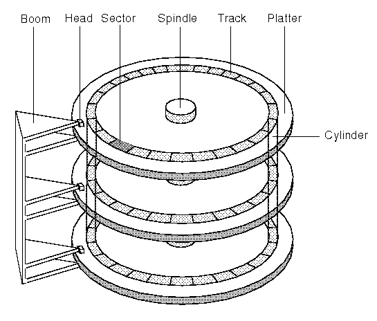

# Lecture 2 - Writing a Program Without an Operating System
## How not to OS

https://omarelamri.notion.site/Lecture-2-April-6th-2023-4e90425e9e26495c9e51461b6bcca275

Write a program: <br>
- count words in a file
- no OS

In order to run this program, it still needs to run on hardware
our hardware has
- x86-64 CPU (IDE)
- disk drive
- RAM
- motherboard
- display
- power button 

The display system displays: `25134`

Since there is no OS/c library/sys calls, we can't use `getchar()` to read the
next byte of input 

some other attributes
- ascii text
- 1 byte per character 
- terminated by a null byte `'\0'`
    - required, or elese program could run indefinitely
- my definition of a word is `[A-Za-z]
- assume we have the function `read_ide_sector(long long s, char buff[512])`
    - `s` = sector #
    - `char buff[512]` = `char * buff`
- our 'text' starts at position `50000` in the drive

ide 
- divides drive into 512 byte sectors
    - we call them sectors as because this is how disk drives are built
    
- disk drive rotates at 120 Hz / 7200 rpm
- disk drive is *actually* split into 512 byte chunks

```c
 // note that we don't return anything or take any 
 // input, since we don't have an OS
 // we want to write a program to count the number of words in an ascii file
void main() { 
    long long int nwords = 0;
    bool inword = false;
    long long s = 50000;
    const SECTOR_SIZE = 512;

    // we want to walk through the program and look at all the words.
    while(true)
        read_ide_sector(s++, &buff[0]);
        for(int i = 0; i < SECTOR_SIZE; i++) {
            if(buf[i] == 0) {
                answer_is(nwords);
                while(true) continue;
                return;
            }
            bool a = isalpha(buff[i]);

                // we're using bitwise operators so the compiler doesn't
                // have to deal with branches 
            nwords += a & ~inword;
            inword = a;

        }
}

int isalpha(int c) 
    return 'a' <= c && c <= 'z' || 'A' <= c && c <= 'Z'; 

// we need to use 'memory map i/o'
// basic idea:
/*

cpu
 |
 ----------------- bus
    |          |  
   ram      [other]
 (lwr addy) (hghr addy)

[other], maginfied
 0xB800 - 4000 bytes
 -------------------
|                   |
 -------------------

- we can write to [other] which will become our display
- text screen: is 80 * 25 
*/
void answer_is(long long n) {
    // set the pointer to the start of [other] + the amount of bytes 
    // plus what it takes to get us roughly to the middle of the screen
    short *p = (short *)0xB800 + 1000;
    
    do
    // gets us ascii value of first char
    *--p = (n % 10  + '0') + (7 << 8);
                        // plus the grey on black ascii code
    while(n /= 10); 
}


/*
cpu
 |    <-inbyte  outbyte->
 -------------------------- bus
    |     |          |   
   ram [other]   dvce cntrlr (cpu)
                     | 
                    disk

1f6 1f5 1f4 1f3 1f2
1f6 - 1f3 must become the sector number we want to read from (50000)
1f2 must be = 0001 since that is how many sectors we are reading from
*/


void wait_for_ready() {
    // while the address is not ready
    // is only ready when 01xxxxxx
    while((inb(0x1f7) & 0xc0) != 0x40);
}
void read_ide_sector(long long s, char buff[512]) {
    wait_for_read();
    outb(0x1f2, 1);
    outb(0x1f2, s & 0xFF);
    outb(0x1f3, s >> s&0xff);
    outb(0x1f4, s >> (s>>8) & 0xff);
    outb(0x1f5, s >> (s>>16) & 0xff);
    outb(0x1f6, s >> (s>>24) & 0xff);
    outb(0x1f7, 0x20); // read sectors
    wait_for_ready();
    insl(0x1f0, buff, 128); // takes what we have from device control and 
                            // ships to the ram via the cpu 
}

```

### but how does all of this code get stuffed into the computer?
we need to compile our code as `gcc -m32`

``` 
|-------RAM------|--ROM--|
so we need to put our program in rom 

%eip -> 0xffff0, which points at rom
```
however, it would be nice to put it on disk and not rom, which is a lot
of work. 
```
// chain loading: get program into rom, then load into disk
// in rom
main:
    read sectors 10000-12000 into ram at location 0x60000
    jmp 0x60000
```
**UEFI**
standard form form for bootloaders that pulls from devices

