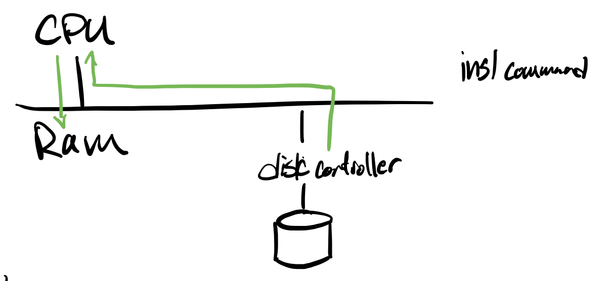
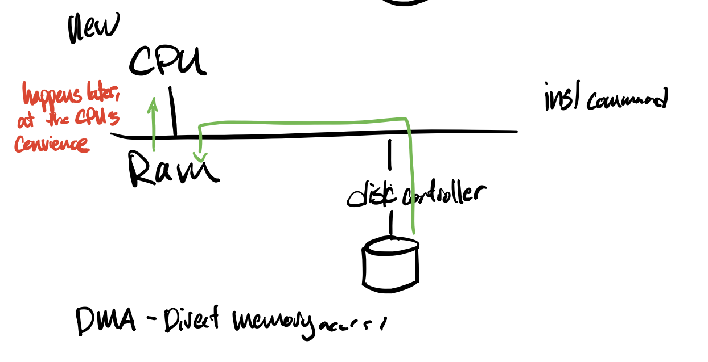
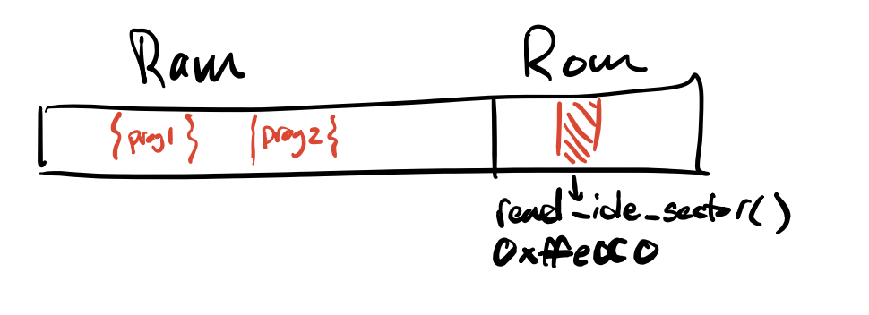

# Lecture 3
last time, we had `read_ide_sector(sector#, char * address)`

## Performance Issues
```
cpu useful ------      ------      ------
 
disk useful      ------      ------
            time -> 
```

## Double buffering
When we are reading data into one command, we computing another command

with double buffering:
```
cpu   -          ----1---- ----2----
disk   ----1---- ----2---- ----3----
```
- This works best when cpu and io power are about the same
- this is less efficient when it is about the same 

## Another Strategy
Old strategy:
memory travels from disk to the CPU, then to RAM

We would rather the cpu talk to the disk controller 


DMA works with different commands than what we talked about last time
Tells the controller which ram address to store into 
The downside of this is more complicated

## Another Strategy
before we had
```c
void wait_for_ready() {
    while(imb(0x1f7)&(0xc0)!=0x40)
}
```
Issue with this is that it is a waste of CPU power

Instead:
```c
void wait_for_ready() {
    while(imb(0x1f7)&(0xc0)!=0x40)
        yield();
}
```
`yield()` is a hand-wavy function that gives control to another function 
- this is called multiprogramming 
- multiprogramming: programs give up cpu to other programs to fully utilize
                    the CPU

## Another Idea 
- main purpose is to simplify the job of doing this kind of performance 
  improvement across several applications
- instead of each program having a copy of `read_ide_sector(sector#, char * address)`,
  one copy of this machine code, all apps share this copy
- however, the real reason is MAINTENANCE
- since there is only one function, we can put all of the optimization stuff
  in this function 

### But where do we put this function?

Another convention idea is loading the ROM `read_ide_sector()` into RAM, which
all programs access

### Issue with this:
- problem is that the people who built the ROM might not know everything about
  the io or the OS or the latest version
- so it often won't use double buffering

### The fix:
- Want the code under our control, as software, not hardcoded into ROM
- so we have it sitting at a specific place in RAM
- but we still run into some maintence issues

### Maintence Issues
- Too much of a pain to change our library functions 
- Too much of a pain to reuse our code in other programs
    - pain to burn it into rom
    - pain to change our standard libraries
    - need to make it easier to hook up code on the fly
- Too much of a pain to run several programs at once 
- Too much of a pain to run buggy programs. We can't trust that every other
  programmer is going to be perfect. 

Our function `read_ide_sector(long sector, char * buf)` is too specific
- tailored to a single drive, other drives might not work

Another idea: <br>
`read_ide_sector(int drive#, long sector#, char * buf)`
- still not good enough. This assumes a certain sector side

Another idea:<br>
`read_ide_sector(int drive#, long sector#, char * buf, size_t #ofBytesToRead)`
- must be a multiple of a sector size 
- purpose of this is to be able to batch io
- and make the program more portable 

Another idea, create another interface: <br>
`read_n_buff(long long location, char * buf, size_t)`
- treates entire thing as one array 

We also need to have some kind of error verification:
- `ssize_t read_n_buff(long long location, char * buf, size_t)`
    - `ssize_t`: gives -1 if failed, otherwise gives number of bytes written

#### Problem Reads
- no privacy
- what if the read spans two drives?

Another idea: <br>
`ssize_t read(int location, void *, size_t)`
- solution that linux uses 
- location is an 'abstract' location, not the actual location
    - called a file descriptor
- `void *` lets you point to anything that you'd like 

We might want to have an application that looks like:
- `char *readline(int fd, char delimiter)`
- wants my function to just gets the line from memory so we could write code like:
```c
while((p=readline(0, '\n'))){
    process_line(p);
}
```
### Problems
- this isn't used for linux because some files might have a line that a terabyte large
    - in other words, the worst case is unbounded 
- lines may cross sector boundaries
- **extra bad problem:** this is returning a pointer to the line you are accessing
    - here is a system call that is allocating memory, and who is here to delete it?
    - this is a huge memory leak
    - progammers are likely to forget about it 
<br><br>
- this might not be an awful idea for higher level stuff, but not for linux

<br>
This is leading to the idea of 

## Modularity

- assign each piece to separate programmers
- decrease our total work
  - roughly, the # of bugs is proportional to the size of the program
  - roughly, the cost to fix a bug is proportional to the size of a the program
  - so the cost to fix the bug is $n^2$ (actually is $2^n$)
  - however, the cost to fix a bug in a module is much less. In total $O(n^2/k)$
  - this is also hand-wavey, but it's a fun metric
- abstraction
  - we don't just want to split up our code randomly. We want to put up nice
    boudnaries between modules

### Implementing Modularity
Classic method of abstraction is with a function call
- looks a bit different at the machine code level than it does on the source
  code level

```c
long fact(long n) {
  if(n <= 1)
    return 1;
  return n * fact(n - 1);
}
```
when compiling with `gcc -O1 -S`

```asm
fact:
    movq $1, rax
    testq rdi, rdi
    jne .L8
    ret

.L8:
    pushq rbx 
    movq rdi, rbx 
    leaq -1(rdi),rdi // subtracts 1 from rdi
    call fact
    imulq rbx, rax
    popq rbx // restores caller's ibx
    ret
```
ABI (application binary interface) for fact
- rdi holds n 
- (%rsp) holds address
- at return 
  - rax holds result 
  - rbx (calle saved) is unchanged from call 
- rsp has to be a multiple of 16 +- 8 

function call modularity 
- pros
  - common
  - fast
- cons
   - Suppose the caller sets rsp to 0
    ``` 
    movq 6 rei
    mov1 $0 rsp
    jmp fact
    ```
    - Callee can make a mistake and cause a crash
    - Caller can make a mistake and cause a crash
    - not fully modular! Soft modularity. Modularity if everyone follows the
      rules and no one has bugs, ex someone writes to another module's asm

## Hard Modularity
- modularity that cannot be broken!
 
 2 ways to get it
 1. client server approach. 
    - caller and callee sit in their own servers
    - neither can access each other's memory. not possible
    - when the caller wants to do something, the callee sends a message to the 
      callee
    - `sendmsg(destination, fnction_call_name, function_args)`
    - `recieve(destination, respnse)`
    - `if response_opcode == "ok"...`
  
  So our callee code looks something like
  ```c
  while(true) {
    recieve(-1, request);
    if(request_name == "fact") {
      compute n;
      sendmsg(back, "n")
    } else { ... }
  }
  ```

  - however, there are some performance issues, as this means that we spend
    a lot of time copying info 
  
  2. Virtualization

  ### One strategy
  - OS (calle) runs an interpreter that executes the machine instructions of 
    of the caller
  - and whenever the caller does anything suspicious, such as setting the stack
    pointer to zero, it stops the code
    - checks every line of code that you have
    - would block `insl`, as it fetches memory from flash
  - however, this is horrible performance

### Strategy 2
Hardware suport for virtualization 
- can run hardware in two modes
  
0. hardware can run any instructions (kernel mode)
1. hardware is suspicious, which can run most of the time, until there's an 
   instruction that could cause trouble, and then the instruction is "trapped"
   - "trapped" means your program has an error 
   - cpu could just halt, but that's not fun
   - more likely, the hardware has some fallback code that recovers from the
     buggy program and moves onto the next program 
      - **trap service vector**
        - maybe dividing by 0 is #12 way to trap
        - will access element 12 of the interrupt service vector
        - this is a protected transfer of control. instruction pointer is now
          running inside the kernel
        - issue is that caller isn't immune to callee code
        
### How traps worked in x86 
You could set `int` (interupt) to 0 - 255
`int 218` meant "do a system call"
```asm
syscall in eax
argsin ebx ecx
```
linux kernel then
- looks at eax
- [thinks]
- rti 

this system is relatively simple, but to some extent, but this isn't really
using hardware for its intended purpse

So for the x86-64
We can use `sysenter`, ran in user mode
- args %rax // contains syscall
- can have up to 6 arguments
Kernel sysexit